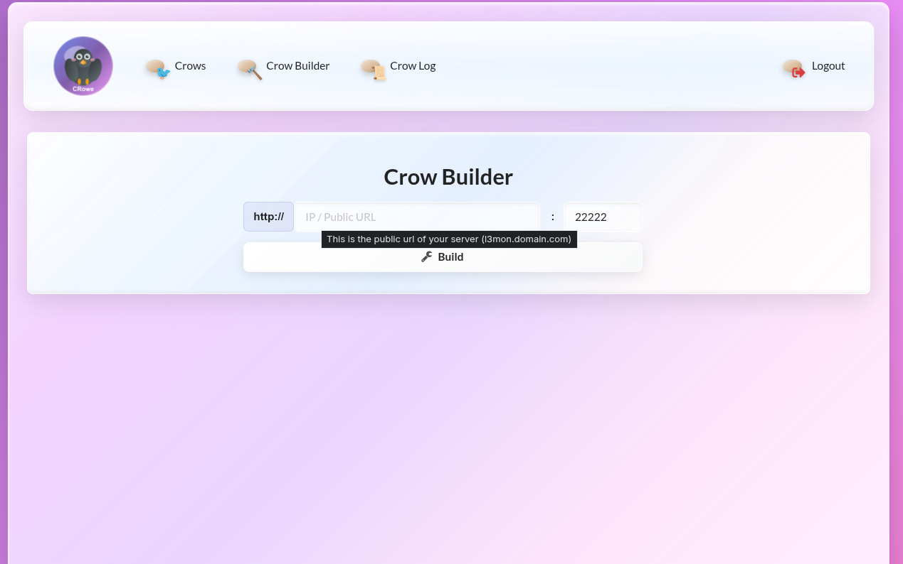
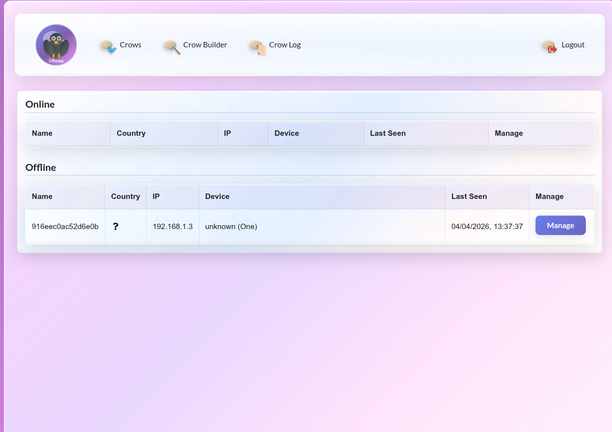
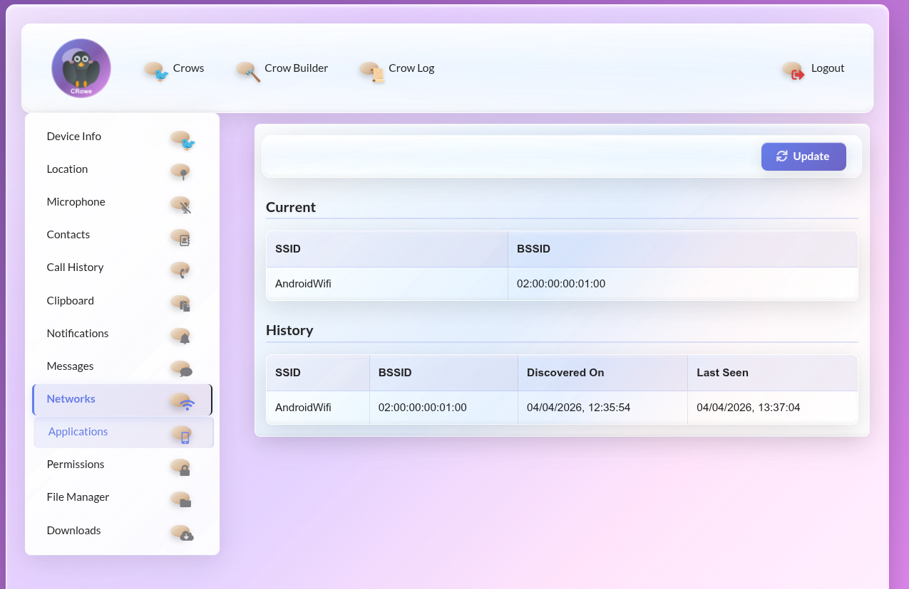
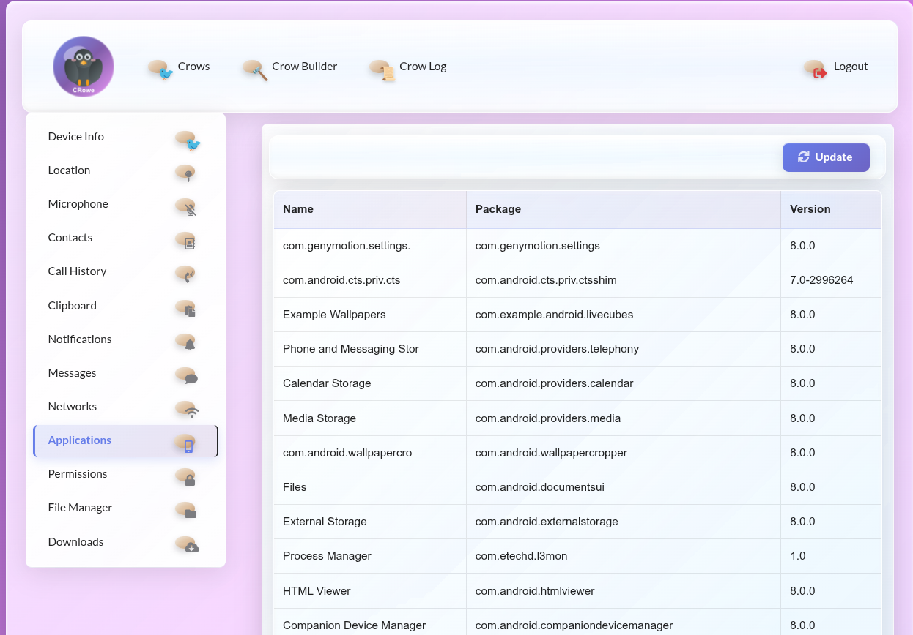

# 🐦 CRowe
**Advanced Remote Management & Network Monitoring Suite**

CRowe is a powerful, web-based remote administration and monitoring system built on **Node.js**. It provides a high-performance, aesthetically pleasing interface for managing distributed devices and monitoring network health from any location.

## 📺 System Demonstration
See the CRowe dashboard and its glassmorphism interface in action:

https://github.com/itsdheera2k1/Crow/blob/main/Screenshots/Screencast_20260407_052112.webm
---

## 🚀 Key Modules

### 🛠️ Crow Builder
The centralized payload generation hub. Configure your server's public IP/URL and listener ports to build custom connection clients instantly.

### 📊 The Crow Log (Device Management)
Monitor your "flock" with real-time status updates. Track online/offline status, IP addresses, and geographic origin of every connected node.

### 🔍 Deep Inspection
Gain granular insights into every managed device:
* **Network Intelligence**: Track SSID/BSSID connection history and current link status.
* **App Audit**: Full visibility into installed packages, versions, and process management.
* **Timeline Tracking**: Detailed logs for "First Seen" and "Last Seen" timestamps.

  
  

---

## 🛠️ Technical Stack
* **Engine**: Node.js (Express & EJS)
* **Frontend**: Custom CSS3 (Glassmorphism & Pastel Aesthetic)
* **Connectivity**: Web-based remote accessibility with encrypted socket handling.

## ⚖️ Disclaimer
This software is developed for **authorized** security auditing and educational purposes. The developer is not responsible for any misuse. Always obtain explicit permission before monitoring any system.

---
**Made with ❤️ By Dheera**
